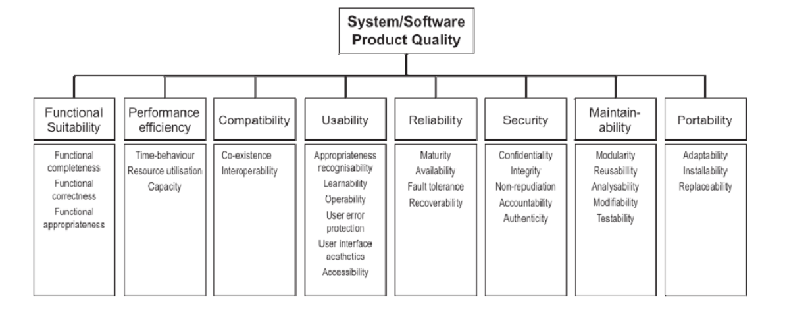

# Fase 1 - Processo de Avaliação

## Sumário
- [Contexto de Trabalho](#contexto-de-trabalho)
- [Aplicação Escolhida](#aplicação-escolhida)
- [Classificação e Ênfase das Características de Qualidade](#classificação-e-ênfase-das-características-de-qualidade)
- [Proposta de Avaliação e Melhoria de Qualidade](#proposta-de-avaliação-e-melhoria-de-qualidade)
- [Especificação do Modelo de Qualidade](#especificação-do-modelo-de-qualidade)
- [Conexão com ODS (Objetivo de Desenvolvimento Sustentável) da ONU](#conexão-com-ods-objetivo-de-desenvolvimento-sustentável-da-onu)
- [Bibliografia](#bibliografia)
- [Referências Bibliográficas](#referências-bibliográficas)
- [Histórico de Versões](#histórico-de-versões)

---

## Contexto de Trabalho 

Este trabalho foi elaborado e desenvolvido no contexto da disciplina de Qualidade de Software, cujo objetivo é proporcionar aos estudantes a compreensão e a aplicação de técnicas, normas e práticas que assegurem a qualidade de produtos e processos de software ao longo de seu ciclo de vida. Como parte das atividades da disciplina, foi proposta a realização de uma análise crítica da qualidade de uma aplicação real, considerando aspectos de qualidade como usabilidade, confiabilidade, segurança, portabilidade, dentre outros.

## Aplicação Escolhida

MEPA , uma plataforma avançada e de software livre desenvolvida por pesquisadores da Universidade de Brasília. Sua finalidade é apoiar a gestão de recursos públicos por meio da análise de contratos de energia com uso de Inteligência Artificial, visando identificar a opção mais vantajosa para as instituições. Trata-se de uma plataforma com interface web, pela qual os usuários inserem dados das faturas para receberem recomendações, relatórios e análises gráficas. O domínio de aplicação do MEPA abrange temas como gestão de energia no setor público , eficiência energética , otimização de custos e sustentabilidade na administração pública.

Apesar de ter funcionalidades voltadas para a gestão de contratos e otimização financeira, o MEPA não foi concebido como um software comercial no sentido tradicional, uma vez que foi desenvolvido em ambiente acadêmico, financiado pelo Governo Federal e distribuído como software livre, com foco no benefício público e sem fins lucrativos.

No entanto, de acordo com a norma IEEE 1062, o MEPA pode ser classificado como um COTS (Commercial Off-The-Shelf Software), pois é um produto padronizado e reconhecido como uma solução de referência para um público amplo (as Instituições Federais de Ensino Superior), e não uma ferramenta personalizada para um cliente individual.

O objetivo estratégico da plataforma é se consolidar como referência em gestão de energia para as instituições públicas, garantindo economia, sustentabilidade e maior eficiência na aplicação dos recursos.

Por fim, a avaliação da qualidade tem como objetivos principais identificar e priorizar as características mais relevantes para seu público-alvo (gestores e técnicos); orientar a melhoria contínua do sistema; e assegurar que o produto esteja alinhado às boas práticas e aos padrões de confiabilidade exigidos para sistemas que apoiam a gestão de recursos públicos.

## Classificação e Ênfase das Características de Qualidade

Nesta etapa inicial do processo de avaliação, foram definidos as características de qualidade a serem considerados com base nos objetivos da avaliação e no perfil do público-alvo. A análise levou em conta tanto as necessidades dos usuários finais quanto os interesses da equipe de desenvolvimento, com o propósito de identificar características críticas para a experiência de uso e o desempenho do sistema.

A seguir, apresenta-se a classificação das características de qualidade com suas respectivas ênfases, conforme os critérios da abordagem SQuaRE (ISO/IEC 25010)[2], em uma escala de 1 a 5. A SQuaRE (Software Product Quality Requirements and Evaluation) é uma norma internacional que define um modelo de qualidade para produtos de software, estabelecendo características e subcaracterísticas que servem como referência para avaliação e especificação da qualidade de sistemas.

| Característica | Ênfase (1-5) |
|---|---|
| Adequação Funcional | 5 – grande interesse  |
| Eficiência de Desempenho | 1 – baixo interesse |
| Compatibilidade | 1 – baixo interesse |
| Usabilidade | 5 – grande interesse / Não pode ser escolhida |
| Confiabilidade | 5 – grande interesse |
| Segurança | 4 – largo interesse |
| Manutenibilidade | 5 – grande interesse |
| Portabilidade | 1 – nenhum interesse |

<b>Autor:</b> <a href="https://github.com/FelipeFreire-gf">Felipe das Neves</a>, 2025

Portanto, foram priorizadas as características de **Adequação Funcional**, **Confiabilidade** e **Manutenibilidade**. A escolha se justifica pela natureza do público-alvo: gestores e equipes técnicas do setor público. A **Adequação Funcional** garante a precisão das análises e recomendações , a **Confiabilidade** assegura a estabilidade e a integridade dos dados para a tomada de decisão sobre recursos públicos , e a **Manutenibilidade** viabiliza a evolução e adaptação do sistema, um software livre  que precisa se manter relevante frente às mudanças regulatórias do setor elétrico."

Essa priorização servirá como base para a especificação das métricas, definição dos critérios de julgamento e planejamento da avaliação, garantindo foco nas qualidades mais relevantes para a experiência e confiança dos usuários no produto avaliado.

## Proposta de Avaliação e Melhoria de Qualidade

A proposta de avaliação tem como principal objetivo assegurar a qualidade da plataforma MEPA a partir das perspectivas dos usuários e desenvolvedores, considerando as características do público-alvo predominante, composto por:

Gestores públicos, administradores, engenheiros e servidores técnicos responsáveis pela gestão de contratos de energia em Instituições Federais de Ensino Superior (IFES).

Profissionais com familiaridade em sistemas de gestão e análise de dados, que necessitam de informações precisas para a tomada de decisão estratégica.

O domínio da aplicação abrange a gestão de contratos de energia, a otimização de custos com recursos públicos e a promoção da eficiência energética e sustentabilidade no setor público. A avaliação visa, portanto, garantir que o produto atenda aos rigorosos requisitos desse público, identificar pontos de melhoria relacionados à eficiência operacional de modo a otimizar a inserção de dados e a clareza dos relatórios analíticos, além de propor sugestões que contribuam para a manutenção da confiabilidade, segurança e manutenibilidade do sistema, aspectos críticos na gestão de recursos públicos.

## Especificação do Modelo de Qualidade

Com o intuito de avaliar a qualidade do software MEPA Energia, o grupo adotou uma adaptação do modelo de qualidade de produto presente na ISO/IEC 25010. O modelo define a qualidade do produto a partir do conjunto oito características e suas respectivas subcaracterísticas conforme ilustrado pela Figura 1. Segundo a ISO 25010, a escolha das características a serem avaliadas em um software dependem dos objetivos de alto nível do projeto a fim de realizar um escopo realista de avaliação da qualidade. Nesse sentido, como foco da avaliação deste trabalho a partir da análise de público-alvo e domínio da aplicação, foram escolhidas três características de qualidade: Adequação Funcional (Functional Suitability), Confiabilidade (Reliability) e Manuntenabilidade (Maintainability). 

    

        <b>Figura 1:</b> Modelo de Qualidade de Produto.
         
        <b>Fonte:</b> 
        ISO/IEC 25010.
    

A seguir, são apresentadas as definições das características escolhidas e suas respectivas subcaracterísticas.

#### Adequação Funcional (Functional Suitability)
Refere-se à capacidade do software de fornecer funções que atendam às necessidades explícitas e implícitas dos usuários. A tabela abaixo detalha as subcaracterísticas associadas:

| **Subcaracterística**   | **Descrição**| **Medidas Comuns** |
|-|-|-|
| **Completude Funcional** | Grau em que o conjunto de funções cobre as tarefas e objetivos do usuário      | • Cobertura da Implementação Funcional: Funções especificadas X Funções ausentes/incorretas |
| **Correção Funcional**   | Grau em que o produto fornece os resultados corretos com a precisão necessária | • Precisão Computacional: frequência de resultados imprecisos durante operação     |
| **Apropriação Funcional**| Grau em que funções facilitam a realização de tarefas e objetivos específicos  | • Apropriação Funcional: proporção de funções implementadas que são apropriadas para tarefas específicas, subtraindo aquelas que apresentam problemas |

#### Confiabilidade (Reliability)
Refere-se à capacidade do software de manter seu nível de desempenho sob condições específicas por um período determinado. As subcaracterísticas incluem:

| **Subcaracterística**   | **Descrição**| **Medidas Comuns** |
|-|-|-|
| **Maturidade** | Grau de confiabilidade do software em operação normal | • Remoção de falhas: Defeitos Detectados X Defeitos Corrigidos;  • Cobertura de testes: A extensão em que os casos de testes foram executados;  • Tempo médio entre falhas: a frequencia em que o sistema falha durante operação. |
| **Disponibilidade** | Grau em que o sistema está operacional e acessível quando necessário para uso | • Proporção de tempo de serviço: Tempo Real x Tempo Planejado;  • Tempo médio de inatividade: Tempo médio em que o sistema fica indisponível. |
| **Tolerância a Falhas** | Grau em que o sistema funciona apesar da presença de falhas | • Prevenção de falhas: capacidade de controlar padrões de falha para evitar falhas criticas;  • Redundância: quantidade de componentes que são instalados de forma redundante para evitar falhas totais. |
| **Recuperabilidade** | Grau em que o sistema consiga retornar a operação normal após a ocorrência de uma falha | • Tempo médio de Recuperação |

#### Manutenibilidade (Maintainability)
Refere-se à facilidade com que o software pode ser modificado para corrigir defeitos, melhorar o desempenho ou adaptar-se a um ambiente em mudança. As subcaracterísticas são:

| **Subcaracterística**   | **Descrição**| **Medidas Comuns** |
|-|-|-|
| **Modularidade** | Grau de acoplamento entre os componentes do software | • Condensabilidade |
| **Reusabilidade** | Grau em que um componente pode ser reutilizado em outras partes do sistema | • Execução da reusabilidade |
| **Analisabilidade** | Grau de eficácia e eficiência para a avaliação de impacto de uma mudança pretendida em uma ou mais partes do sistema | • Suficiência da função de diagnóstico  • Capacidade de trilha de auditoria |
| **Modificabilidade** | Grau de eficiência em se alterar parte do produto sem a introdução de defeitos ou degradação da qualidade | • Taxa de sucesso da modificação  • Complexidade da modificação |

## Conexão com ODS (Objetivo de Desenvolvimento Sustentável) da ONU

A aplicação avaliada apresenta forte alinhamento com diversos Objetivos de Desenvolvimento Sustentável (ODS) propostos pela Organização das Nações Unidas (ONU)[3], demonstrando seu potencial de impacto positivo em múltiplas dimensões sociais, econômicas e ambientais. A seguir, destacam-se os ODS com os quais a aplicação se conecta diretamente:

#### **ODS 4: Educação de Qualidade**

O MEPA contribui diretamente para a melhoria da educação de qualidade de duas maneiras principais:

* **Reinvestimento de Recursos:** A plataforma é direcionada a Instituições Federais de Ensino Superior (IFES). Ao gerar economia nos custos com energia, um dos principais gastos de um campus, o sistema libera recursos públicos que podem ser realocados para atividades finalísticas da educação, como pesquisa, infraestrutura de salas e laboratórios, bolsas de estudo e contratação de professores. Essa otimização financeira fortalece a capacidade das universidades de oferecer um ensino de maior qualidade.
* **Inovação Acadêmica:** O próprio desenvolvimento da plataforma por pesquisadores da Universidade de Brasília é um produto da educação de qualidade. O MEPA serve como um exemplo prático de como o conhecimento gerado no ambiente acadêmico pode ser transformado em soluções inovadoras com impacto real para a sociedade, incentivando novos projetos de pesquisa e desenvolvimento tecnológico dentro das universidades.

#### **ODS 7: Energia Limpa e Acessível**

O alinhamento com este objetivo é central para a função do MEPA, focado em tornar a energia mais acessível e promover a eficiência energética.

* **Acessibilidade e Redução de Custos:** O objetivo primário da plataforma é encontrar o contrato de energia ideal para reduzir custos. Ao analisar faturas e padrões de consumo, o sistema identifica a opção mais vantajosa, tornando os custos com energia mais acessíveis para as instituições públicas.
* **Eficiência Energética:** O lema "Mais eficiência, menos custos" demonstra o foco em otimizar o uso da energia. A plataforma fornece relatórios detalhados e gráficos que permitem aos gestores identificar padrões de consumo e tomar decisões estratégicas para otimizar o uso. Um consumo mais eficiente diminui o desperdício e a demanda geral sobre a rede elétrica, que é um pilar da sustentabilidade energética.

#### **ODS 11: Cidades e Comunidades Sustentáveis**

As instituições de ensino são componentes vitais das cidades, e sua gestão impacta diretamente a comunidade ao redor.

* **Uso Eficiente de Recursos Públicos:** A plataforma promove uma gestão energética inteligente em grandes centros de consumo, como os campi universitários. Essa gestão eficiente de recursos públicos contribui para a sustentabilidade da infraestrutura urbana, reduzindo a sobrecarga na rede elétrica local e promovendo uma cultura de responsabilidade fiscal e ambiental.
* **Modelo de Boa Governança:** O reconhecimento do MEPA pelo TCU como uma referência em gestão de energia estabelece um modelo de boas práticas. A adoção do sistema por instituições federais pode inspirar outras entidades públicas e privadas na cidade a adotarem práticas de gestão mais sustentáveis, melhorando a eficiência da comunidade como um todo.

#### **ODS 12: Consumo e Produção Responsáveis**

O MEPA é uma ferramenta que induz padrões de consumo mais responsáveis.
**Gestão Baseada em Dados:** Ao exigir o cadastro de faturas e analisar os dados de consumo e demanda, a plataforma capacita as instituições a entenderem profundamente seus perfis de consumo. Esse entendimento é o primeiro passo para um consumo responsável, permitindo que os gestores saiam de um modelo passivo para um modelo ativo e estratégico de uso da energia.
**Otimização e Redução de Desperdício:** A análise comparativa entre o cenário atual e o proposto pelo sistema expõe ineficiências e oportunidades de melhoria. Ao recomendar o contrato ideal, o MEPA não apenas reduz custos, mas incentiva um consumo alinhado à real necessidade da instituição, combatendo o desperdício e promovendo uma utilização mais racional e sustentável dos recursos energéticos.

<b>Autor:</b> <a href="https://github.com/FelipeFreire-gf">Felipe das Neves</a>, 2025

---

## Contribuição da Equipe

Para verificar a contribuição, acesse o documento de [Participação dos Integrantes na Fase 1](fase1/partIntegrantesFase1.md).

---

## Bibliografia
> \- ISO/IEC 25000 SQuaRE series Systems and software engineering — Systems and software Quality Requirements and Evaluation (SQuaRE). Disponível em: <https://committee.iso.org/sites/jtc1sc7/home/projects/flagship-standards/iso-25000-square-series.html>. Acesso em: 26 de setembro de 2025. 
 
> \- ISO/IEC 25010. Disponível em: <https://iso25000.com/index.php/en/iso-25000-standards/iso-25010>. Acesso em: 26 de setembro de 2025.

> \- Documentação do Mepa. Disponível em: <https://gitlab.com/lappis-unb/projetos-energia/mec-energia/documentacao>. Acesso em: 26 de setembro de 2025.

## Referências Bibliográficas

> [1] Mepa. Disponível em: <https://mepaenergia.org/>. Acesso em: 26 de setembro de 2025.

> [2] ISO/IEC 25010. Disponível em: <https://iso25000.com/index.php/en/iso-25000-standards/iso-25010>. Acesso em: 26 de setembro de 2025.

> [3] ONU. Objetivos de Desenvolvimento Sustentável. Disponível em: <https://brasil.un.org/pt-br/sdgs>. Acesso em: 26 de setembro de 2025.

---

## Histórico de Versões

| Versão | Descrição | Autor(es) | Data de Produção | Revisor(es) | Data de Revisão | Incremento do Revisor |
| :----: | --------- | --------- | :--------------: | ----------- | :-------------: | :-------------------: |
| `1.0` | Modelagem inicial do documento. | [Felipe das Neves](https://github.com/FelipeFreire-gf) | 24/09/2025 | | | |
| `1.1` | Desenvolvimento dos tópicos: Contextualização do Problema, Aplicação Escolhida, Classificação e Ênfase das Características de Qualidade | [Felipe das Neves](https://github.com/FelipeFreire-gf) | 26/09/2025 | | | |
| `1.2` | Desenvolvimento dos tópicos: Proposta de Avaliação e Melhoria de Qualidade | [Felipe das Neves](https://github.com/FelipeFreire-gf) | 26/09/2025 | | | |
| `1.3` | Desenvolvimento dos tópicos: Especificação do Modelo de Qualidade e Conexão com ODS (Objetivo de Desenvolvimento Sustentável) da ONU | [Felipe das Neves](https://github.com/FelipeFreire-gf) | 26/09/2025 | | | |
| `1.4` | Desenvolvimento dos tópicos: Especificação do Modelo de Qualidade | [Pedro Barbosa](https://github.com/pedrobarbosaocb) | 28/09/2025 | | | |